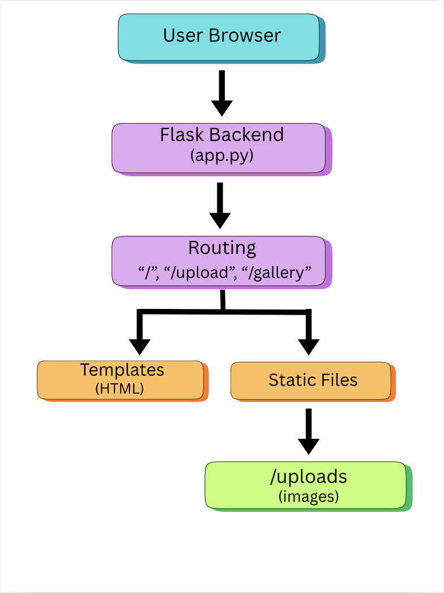

# Read Me- Final Case Study

### Executive Summary
##### This project was designed as a way for users to upload and organize a series of photos in one concise location which are stored locally. This project created a simple webpage that allows users to post images from their computer via an "upload" button on the main page. Then, users can see what has been uploaded to the website by viewing the gallery. The user can navigate back and forth between the upload and gallery page easily. Images are stored locally under static/uploads and the system is containerized with Docker.

### System Overview
##### This project relates to the course concept of making a API with Flask. 

##### * Users can upload PNG, JPG, JPEG, GIF which are then stored in static/uploads. 
##### * This project uses a MIT License

### How to Run
##### Docker
```python
# build
docker build -t photo-gallery .

#run
docker run --rm -p 5000:5000 photo-gallery
```
#### open in browser: http://localhost:5000

### Design Concepts
##### I chose to make this website as my project because it was inspired by case07, which was the one I most enjoyed. I felt that making a photo gallery like this one would allow me to be more creative and integrate principals of design, rather than a more technical project, like serving a vLLM. I chose to use Flask because it is good for small applications and is easily containerized. However, this project was not particularly complex and the uploads are only stored locally. There are no secrets in the repository. The log output is accessable via Docker logs.  


### Results and Evaluation
##### Sample output screenshots of website and Docker:


##### Upload validation prevents unsupported file types. 

### What's Next?
##### If I were to continue to develop this project, I would focus on making it more complex/multiuser and making it more aesthetically pleasing. Instead of a general photo gallery, I would select a theme for my website, such as sport photos or cooking photos. Then, I would select a color palette that matches the theme. Finally, I would add albums so similar photos can be grouped in the gallery.

### Links
##### Github Repository: https://github.com/msm4eh/finalcasestudy


