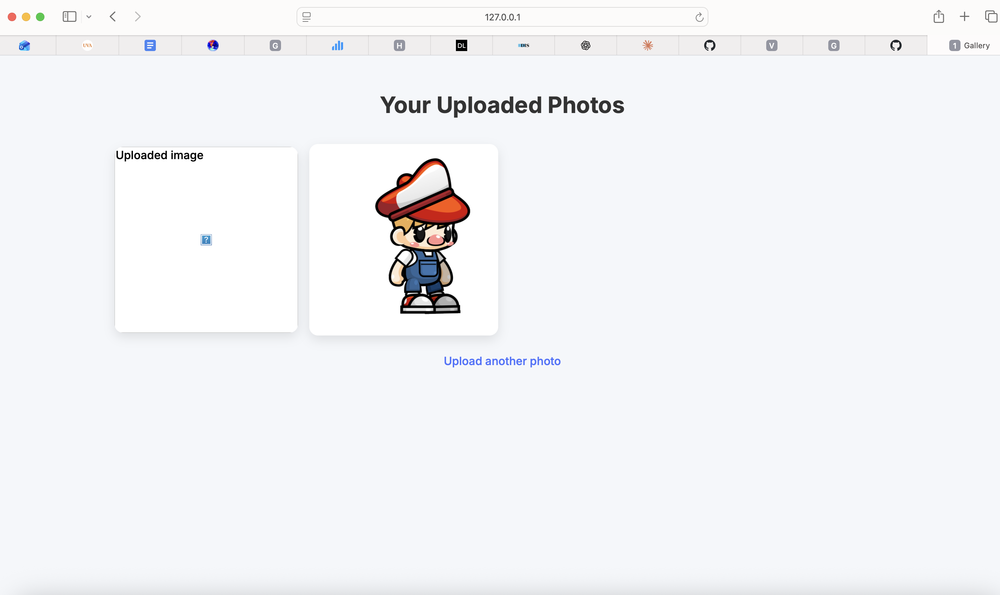
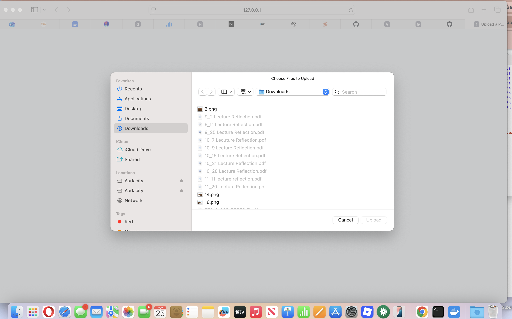
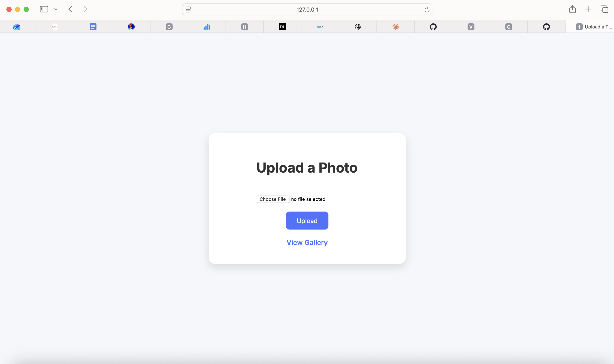
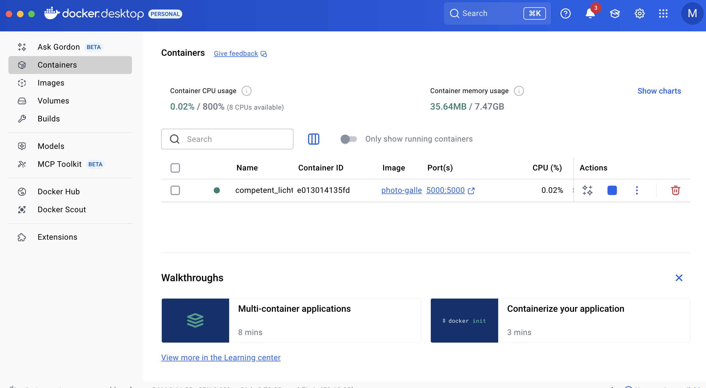

# Read Me- Final Case Study

### Executive Summary
##### This project was designed as a way for users to upload and organize a series of photos in one concise location that can be publicly accessed. This project created a simple webpage that allows users to post images from their computer via an "upload" button on the main page. Then, users can see what has been uploaded to the website by viewing the gallery. The user can navigate back and forth between the upload and gallery page easily. 

### System Overview
##### This project relates to the course concept of making a Flask API. 
add architecture png
talk about images in uploads
##### This project uses a MIT License

### How to Run
##### Docker
```python
# build
docker build -t photo-gallery .

#run
docker run --rm -p 5000:5000 photo-gallery
```
#### open in browser: http://localhost:5000

### Design Concepts
##### I chose to make this website as my project because it was inspired by case07, which was the one I most enjoyed. I felt that making a photo gallery like this one would allow me to be more creative and integrate principals of design, rather than a more technical project, like serving a vLLM. However, this project was not particularly complex and needs to be run with Docker commands each time someone wishes to access the website. 
talk about security 

### Results and Evaluation
##### Sample output screenshots of website and Docker:





talk about tests

### What's Next?
##### If I were to continue to develop this project, I would focus on making it more complex and making it look more aesthetically pleasing. For example, I would make it a gallery for a certain theme of photo, rather than any photo in general. I would tailor the color palette of the website to match the purpose of the gallery. Also, I add a feature that creates photo albums so that the photos in the gallery are better organized. 

### Links
##### Github Repository: https://github.com/msm4eh/finalcasestudy


